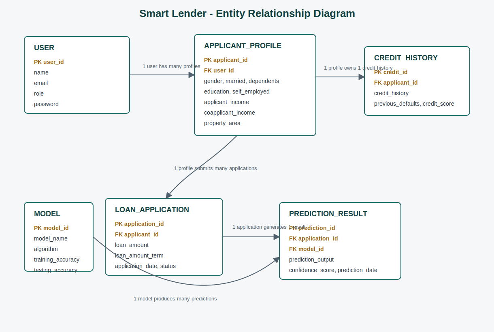

# Smart Lender

Smart Lender is a Flask web application that predicts whether a loan applicant is likely to be approved. It trains and compares Decision Tree, Random Forest, K-Nearest Neighbors, Logistic Regression, and XGBoost classifiers, then saves the best-performing model for real-time prediction.

If `data/loan_prediction.csv` is not available, the training script creates a realistic sample dataset so the project can run immediately.

## Project Structure

```text
Smart Lender/
  app.py
  train_model.py
  requirements.txt
  data/
  models/
  static/
    css/styles.css
  templates/
    index.html
    result.html
```

## Run Locally

```bash
pip install -r requirements.txt
python train_model.py
python app.py
```

Open the app at:

```text
http://127.0.0.1:5000
```

## Dataset Columns

The app expects these applicant fields:

- Gender
- Married
- Dependents
- Education
- Self_Employed
- ApplicantIncome
- CoapplicantIncome
- LoanAmount
- Loan_Amount_Term
- Credit_History
- Property_Area
- Loan_Status

`Loan_Status` should contain `Y` for approved applicants and `N` for rejected applicants.

## Preprocessing Behavior

Before training, the dataset is preprocessed as follows:

- Missing numeric values are replaced with the column mean
- Missing categorical values are replaced with the most frequent value (mode)
- Numerical features are scaled using standard scaling to normalize input ranges
- Scaling is applied only to the input features (X), not to the target variable (`Loan_Status`)
- Categorical columns are encoded using one-hot encoding so the model can train on numeric inputs

## Train/Test Split

The dataset is split into input features (`X`) and the target variable (`y`) before training. `X` contains all columns except the target variable, while `y` contains only `Loan_Status`.

The split uses `sklearn.model_selection.train_test_split()` with:

- `test_size=0.2`: Reserve 20% of the dataset for testing
- `random_state=42`: Seed for reproducible train/test splits
- `stratify=y`: Preserve the target class distribution between train and test sets

## Load the Dataset

This project uses `pandas` to read the dataset and `matplotlib` with the `fivethirtyeight` style for consistent plots.

```python
import pandas as pd
import matplotlib.pyplot as plt
from pathlib import Path

plt.style.use("fivethirtyeight")

data_path = Path("data/loan_prediction.csv")

if data_path.suffix == ".csv":
    df = pd.read_csv(data_path)
elif data_path.suffix in {".xlsx", ".xls"}:
    df = pd.read_excel(data_path)
elif data_path.suffix == ".json":
    df = pd.read_json(data_path)
else:
    df = pd.read_table(data_path)

print(df.shape)
print(df.head())
print(df.columns.tolist())
```

Use `pd.read_csv()` when the dataset is stored as a CSV file, as in this repository.

## Univariate Analysis

To explore the distribution of individual features before modeling, run:

```bash
python data/univariate_analysis.py
```

This script generates two plots in the data folder:

- `data/univariate_continuous.png` for continuous variables such as applicant income and credit history
- `data/univariate_categorical.png` for categorical variables such as gender, education, and property area
- `data/multivariate_swarmplot.png` for multivariate relationships using seaborn swarmplot

Interpretation tips:

- A right-skewed or long-tailed shape often suggests the feature may benefit from transformation.
- Count plots help reveal class balance or dominant categories in categorical features.
- These plots are useful for spotting unusual values or imbalance before preprocessing and model training.
- Bivariate count plots compare pairs like gender vs married status, education vs self-employment, and property area vs loan term to reveal demographic and geographic trends in loan applications.

## Final Output

The final web output is an approval decision:

- `Loan Approved`
- `Loan Rejected`

The prediction page also displays the model confidence and selected model name.

## Entity Relationship Diagram



## Documentation

- [Tools and Technologies Used](docs/tools-and-technologies.md)
- [Project Workflow](docs/project-workflow.md)
